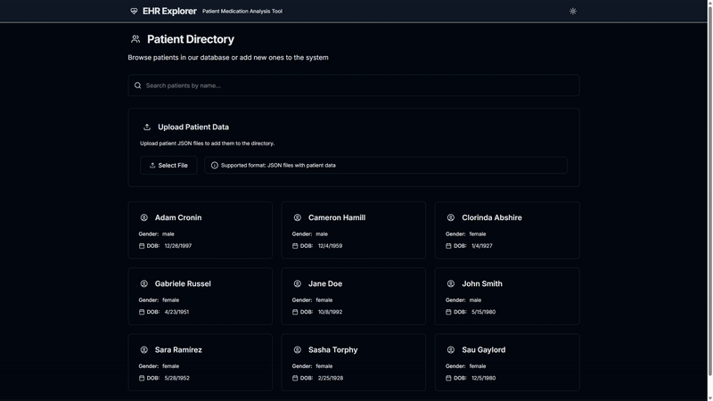

# EHR Explorer: Patient Medication Analysis Tool



EHR Explorer is a web application that processes longitudinal Electronic Health Record (EHR) data from synthetic patients to deliver AI-powered insights into medication patterns and health trends.

## Features

- Interactive AI-powered insights into medication patterns and health trends.
- Comprehensive cross-analysis of conditions and medications.
- Longitudinal analysis of patient data.

## Tech Stack

- **Frontend**: Next.js 15 with React 18, Tailwind CSS
- **Backend**: Next.js API routes, SQLite database
- **AI Integration**: Google Gemini 2.0 Flash model

## Setup Instructions

1. Clone the repository:
   ```bash
   git clone https://github.com/danielhafezi/EHR-Explorer-Patient-Medication-Analysis-Tool
   cd ehr-explorer
   ```

2. Install dependencies:
   ```bash
   npm install
   ```

3. Create a `.env.local` file in the project root with your Gemini API key:
   ```
   GEMINI_API_KEY=your-api-key-here
   ```

## Running the Application

Start the development server:
```bash
npm run dev:watch
```

The application will be available at [http://localhost:3000](http://localhost:3000).

## License

This project is licensed under the MIT License.
